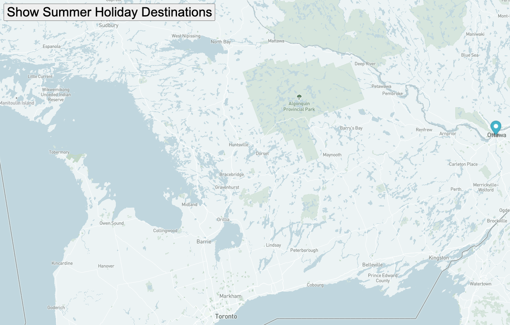

# Map Animation

## Description:
We used MapBox to import a map onto our index.html page.  Using JavaScript we added markers to the map in certain locations.  Using a for loop, the markers are shown on the map at a set time interval.  Clicking the button on the index.html page initiates the 'move()' function.

## How to Run:
1. Clone Repository to your local environment.
2. Open index.html in a Web Browswer.
3. Click the 'Show Summer Holiday Destinations' button.
4. The markers should appear at the set destinations.

## Roadmap for Future Improvements:
1. Add Tags to the Markers that give location details.
2. Animate the Markers so they travel the path to each Destination.

## License Information:
MIT License